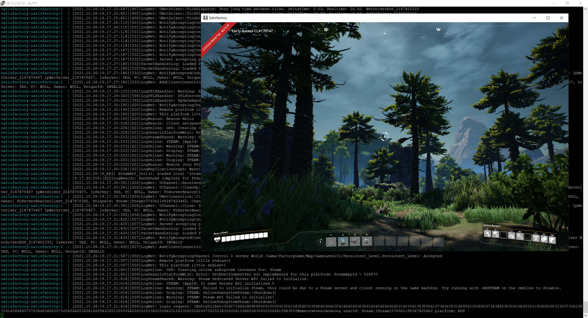

# Dedicated Satisfactory server

This is the official dedicated Satisfactory server, packed as a Docker image. It's currently in an experimental state. Be aware that things may change.



## Usage

Without docker-compose:

```sh
docker volume create satisfactory
docker run \
  -p 15777:15777/tcp \
  -p 15777:15777/udp \
  -p 15000:15000/tcp \
  -p 15000:15000/udp \
  -p 7777:7777/tcp \
  -p 7777:7777/udp \
  -v satisfactory:/home/steam/satisfactory/FactoryGame/Saved/ \
  therealhenning/satisfactory:latest
```

With docker-compose:

```yml
services:
  satisfactory:
    image: therealhenning/satisfactory:latest
    restart: always
    ports:
      - "15777:15777/tcp"
      - "15777:15777/udp"
      - "15000:15000/tcp"
      - "15000:15000/udp"
      - "7777:7777/tcp"
      - "7777:7777/udp"
    volumes:
      - satisfactory:/home/steam/satisfactory/FactoryGame/Saved/

volumes:
  satisfactory: {}
```

The first server start up takes a while since the server files are downloaded from Steam. After the container was created and all the server files were downloaded initially, the server start up should be much faster.
